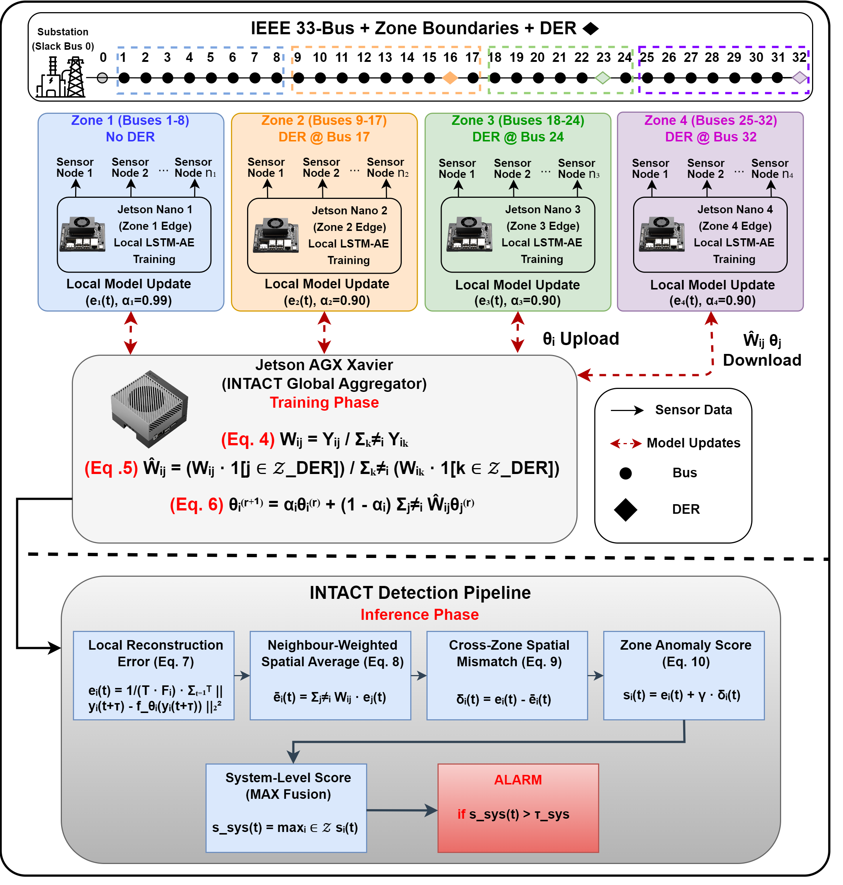

# INTACT: Topology-Aware Federated Learning for Cyber-Physical Intrusion Detection in DER Networks

**Muhammad Hamza Karim, Derrick Agyapong, Bo Tu, Prakash Ranganathan**  
Center for Cyber Security Research (C2SR), University of North Dakota

---



---

## Overview

Modern power grids integrating solar and other Distributed Energy Resources (DERs) face a critical security vulnerability: the natural variability of DER output creates an ideal cover for stealthy temporal cyberattacks. A replay attack — where an adversary records legitimate grid measurements and reinjects them later — produces signals that are statistically indistinguishable from normal solar fluctuations, allowing it to evade isolated local detectors entirely.

**INTACT** (Intelligent Network Topology-Aware Collaborative Training) addresses this by embedding the physical electrical topology of the grid directly into the federated learning process. Rather than treating all edge clients equally, the aggregation server weights inter-zone model sharing by the actual admittance of the lines connecting them. During detection, each zone's reconstruction error is cross-validated against what its electrically coupled neighbors predict — the spatial inconsistency that a replay attack unavoidably introduces, even when the local signal appears normal.

The system is trained and evaluated on a physical testbed of five NVIDIA Jetson devices. Raw operational data never leaves any edge device.

---

## Key Results

| Architecture | Privacy | Topology-Aware | Precision | Recall | F1 | AUC |
|---|:---:|:---:|:---:|:---:|:---:|:---:|
| Centralized LSTM (upper bound) | No | No | 0.708 | 0.920 | 0.800 | 0.971 |
| Local LSTMs Avg (Zones 2/3/4) | Yes | No | 0.620 | 0.793 | 0.690 | 0.937 |
| FedAvg | Yes | No | 0.548 | 0.494 | 0.520 | 0.915 |
| FedProx (µ=0.001) | Yes | No | 0.508 | 0.477 | 0.492 | 0.909 |
| FedAdam (η=0.01) | Yes | No | 0.509 | 0.663 | 0.576 | 0.892 |
| Ditto (λ=0.1) | Yes | No | 0.655 | 0.439 | 0.525 | 0.919 |
| **INTACT (Proposed)** | **Yes** | **Yes** | **0.664** | **0.811** | **0.730** | **0.930** |

INTACT closes 75% of the F1 gap between FedAvg and the centralized upper bound while preserving full data privacy. Inference latency (11.12 s) is indistinguishable from standard FedAvg (11.19 s).

---

## Repository Structure

```
.
├── INTACT.png                          # Framework diagram
├── IDS.pdf                             # Paper (final draft)
│
├── IDS DATASET/
│   ├── eda_simulation.ipynb            # PandaPower simulation + EDA
│   ├── simulation_with_der.csv         # Raw simulation output (DER active)
│   ├── simulation_no_der.csv           # Raw simulation output (DER off)
│   ├── zone_admittance.csv             # Inter-zone admittance matrix
│   ├── fig1_der_impact_1.png           # Paper Fig. 1
│   ├── fig2_correlation.png            # Paper Fig. 2
│   └── IDS_TRAINING&TEST_DATA/
│       ├── zone{1-4}_train.csv         # Per-zone training sets
│       ├── zone{1-4}_test.csv          # Per-zone test sets (with attack labels)
│       └── zone_admittance.csv
│
├── ML model/
│   ├── centralized_lstm.ipynb          # Centralized baseline training
│   ├── lstm_intact_v4.ipynb            # INTACT + local model training
│   ├── models/                         # Saved .keras models, scalers, thresholds
│   └── results/
│       ├── fl/                         # Per-method FL results (summaries, models, arrays)
│       └── comparison/                 # Cross-method comparison figures
│
└── FL/
    ├── Client/
    │   ├── Client.py                   # Flower NumPyClient (LSTM-AE, FedAvg/FedProx/FedAdam)
    │   ├── Dockerfile
    │   └── requirements.txt
    └── Server/
        ├── Server.py                   # INTACT aggregation server (admittance-weighted)
        ├── test_server.py              # FedAvg / FedProx / FedAdam evaluation
        ├── test_intact.py              # INTACT evaluation (cross-zone mismatch scoring)
        ├── ditto_personalize.py        # Ditto local fine-tuning
        ├── test_ditto.py               # Ditto evaluation
        ├── zone_admittance.csv         # Required at runtime
        ├── Dockerfile
        └── requirements.txt
```

---

## Zone Partitioning

The IEEE 33-Bus radial distribution system is partitioned into four operational zones. Bus 0 (substation slack, fixed at 1.0 pu) is excluded from all zone models.

| Zone | Buses | Features | DER |
|---|---|:---:|---|
| Zone 1 | 1 – 8 | 32 | None |
| Zone 2 | 9 – 17 | 36 | 0.5 MW solar at Bus 17 |
| Zone 3 | 18 – 24 | 28 | 0.4 MW solar at Bus 24 |
| Zone 4 | 25 – 32 | 32 | 0.6 MW solar at Bus 32 |

---

## Hardware Testbed

| Device | Role |
|---|---|
| NVIDIA Jetson AGX Xavier (16 GB, 512-core Volta) | FL Server — INTACT aggregation |
| NVIDIA Jetson Nano × 4 (4 GB, 128-core Maxwell) | FL Clients — one per zone |

Communication runs over local Ethernet via the [Flower](https://flower.ai/) (flwr) framework.

---

## Running FL Training

### 1. Build and push Docker images

```bash
cd FL

docker build --platform linux/arm64 \
  -t hamzakarim07/flwr_server_intact:latest -f Server/Dockerfile Server

docker build --platform linux/arm64 \
  -t hamzakarim07/flwr_client_intact:latest -f Client/Dockerfile Client

docker push hamzakarim07/flwr_server_intact:latest
docker push hamzakarim07/flwr_client_intact:latest
```

> Images are ARM64 (JetPack 6 / L4T r36.2). Build directly on a Jetson or use QEMU on x86.

### 2. Start the server (AGX Xavier)

```bash
docker run -d --name flwr-server --runtime=nvidia --gpus all \
  -p 8080:8080 \
  -v ~/fl/models:/app/src/models \
  -v ~/fl/results:/app/src/results \
  hamzakarim07/flwr_server_intact:latest

docker exec -it flwr-server bash -c "cd /app/src && python3 Server.py"
```

### 3. Start all four clients

```bash
bash start_clients.sh
```

`start_clients.sh` SSHes into all four Jetson Nanos in parallel and launches each client container with the correct `ZONE_ID` and `SERVER_ADDRESS` — no prompts needed.

### 4. Evaluate

```bash
# INTACT (topology-aware, cross-zone mismatch scoring)
docker exec -it flwr-server bash -c "cd /app/src && python3 test_intact.py"

# Standard baselines (FedAvg, FedProx, FedAdam)
docker exec -it flwr-server bash -c "cd /app/src && python3 test_server.py"

# Ditto
docker exec -it flwr-server bash -c "cd /app/src && python3 test_ditto.py"
```

Results are saved to `~/fl/results/` on the server host.

---

## Dependencies

**Python:** 3.10  
**Base image:** `nvcr.io/nvidia/l4t-ml:r36.2.0-py3` (JetPack 6, TF 2.16, CUDA 12.2)

```
flwr==1.5.0
tf-keras
numpy<2
pandas
scikit-learn
matplotlib
joblib
```
